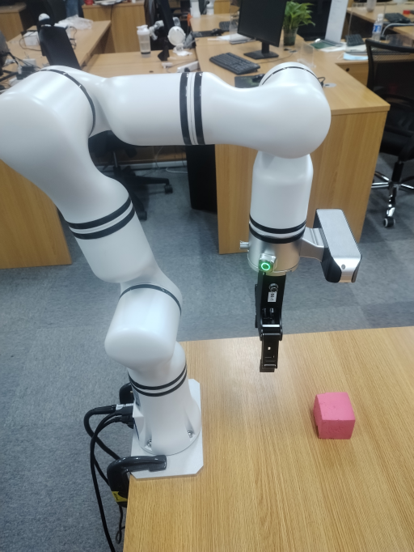

# 机械臂视觉伺服V1.0

一种适用于RM机械臂结合视觉实现视觉伺服的功能。视觉伺服通过视觉反馈控制机械臂，实现精准定位和动态环境下的自动操作。

**基本方法**
其中方法包括如下步骤：
（1）采用任意方案确定在摄像头下需要追踪的物体的xyz坐标信息。
（2）将坐标信息输入给到视觉伺服实例，将自动开始伺服。

**使用场景**
视觉伺服应用于自动化生产线、仓储物流、机器人抓取、精密装配等场景，依赖视觉反馈实时调整机械臂动作，实现高精度操作与动态环境中的自主作业。

**目标用户**

- 集成开发者 & 机械臂应用开发者：视觉伺服系统可用于将机械臂与视觉集成，应用于生产线装配、智能仓储等场景，提升自动化精度，缩短开发周期。

- 科研用户：支持科研人员在机器人视觉与控制领域进行算法优化、大模型测试等前沿探索，推动智能化应用研究。

- 教育用户：用于机器人视觉、控制实验教学，让学生实践理论知识，设计并完成相关实验项目。

## 2.快速入门

### 基础环境准备

| 项目     | 版本                 |
|:-------|:-------------------|
| 操作系统   | ubuntu20.04        |
| 架构     | x86                |
| 显卡驱动   | nvidia-driver-535  |
| Python | 3.8                |
| pip    | 24.9.1             |

### Python环境准备

| 依赖                     | 版本        |
|:-----------------------|:----------|
| opencv-python          | 4.10.0.84 |
| loguru                 | 0.7.2     |
| spatialmath-python     | 1.1.8     |
| roboticstoolbox-python | 1.1.0     |

（1）确保已经安装了基本环境

安装conda包管理工具和python对应环境，详细参考《[安装conda和python环境](D:/文档总结/第二版/安装conda环境/安装conda和python环境.md)》

（2）构建python环境

创建conda虚拟环境

```
conda create --name [conda_env_name] python=3.8 -y
```

激活虚拟环境

```
conda activate [conda_env_name]
```

查看python版本

```
python -V
```

查看pip版本

```
pip -V
```

更新pip到最新版本

```
pip install -U pip
```

（3）安装python环境三方包依赖

安装opencv相关依赖，这会将numpy等相关依赖一并安装

```
pip install opencv-python==4.10.0.84
```

安装日志相关依赖

```
pip install loguru==0.7.2  
```

安装spatialmath相关依赖，他会一并将Pillow、scipy相关包安装

```
pip install spatialmath-python==1.1.8
```

安装机器人开发包roboticstoolbox-python

```
pip install roboticstoolbox-python==1.1.0
```

若您在安装roboticstoolbox-python过程中出错或者安装完成无法使用，可以卸载之后下载源码重新安装。

```
git clone https://github.com/petercorke/robotics-toolbox-python.git
cd robotics-toolbox-python
pip3 install -e .
```

### 代码获取

代码可以在[github链接](https://github.com/RealManRobot/visual-servo)获取最新代码。

### 运行代码

```python
# 实例化视觉伺服对象，传入相关的参数，参数介绍见
ibvs = ImageBaseVisualServo(
    ip="192.168.1.18",  # 机械臂IP地址
    port=8080,  # 机械臂透传端口
    init_joint=[-2.288, -8.908, 97.424, -0.788, 88.872, -0.019],  # 给定机械臂的初始位姿
    center=[320, 240, 250],  # 视觉伺服追踪点位对齐位置，前两位代表是画面像素点，表示将物体固定到这个位置上。
    # 最后一位是机械臂末端到物体的距离，单位为mm
    hand_to_camera=np.array([[-0.013, 1, -0.0004, -0.092],  # 手眼标定矩阵
                             [-1, -0.013, 0.01, 0.03],
                             [0.009, 0.004, 1, 0.034],
                             [0, 0, 0, 1]])
)

# 定义线程和启动线程
thread2 = threading.Thread(target=ibvs.run)
thread2.start()

while True:
    """
    以下为模拟每秒发一个坐标信息，实际的频率可以更高，最高上限200HZ
    """
    time.sleep(1)
    ibvs.center = [280, 200, 250]
    time.sleep(1)
    ibvs.center = [360, 200, 250]
    time.sleep(1)
    ibvs.center = [360, 280, 250]
    time.sleep(1)
    ibvs.center = [280, 280, 250]
```

或使用如下示例，如下示例是基于任意物体识别的

```python
# 实例化视觉伺服对象，传入相关的参数，参数介绍见
ibvs = ImageBaseVisualServo(
    ip="192.168.1.18",  # 机械臂IP地址
    port=8080,  # 机械臂透传端口
    init_joint=[-2.288, -8.908, 97.424, -0.788, 88.872, -0.019],  # 给定机械臂的初始位姿
    center=[320, 240, 250],  # 视觉伺服追踪点位对齐位置，前两位代表是画面像素点，表示将物体固定到这个位置上。
    # 最后一位是机械臂末端到物体的距离，单位为mm
    hand_to_camera=np.array([[-0.013, 1, -0.0004, -0.092],  # 手眼标定矩阵
                             [-1, -0.013, 0.01, 0.03],
                             [0.009, 0.004, 1, 0.034],
                             [0, 0, 0, 1]])
)

# 定义线程和启动线程
thread2 = threading.Thread(target=ibvs.run)
thread2.start()

# 伪代码，加载视频流对象
camera = RealSenseCamera()
# 伪代码，加载识别模型
model = detect.gen_model()
# 指定需要追踪的物体
input = "Fang_Kuai"

while True:
    # 伪代码，获取视频流
    color_img, depth_img, _, _, _aligned_depth_frame = camera.read_align_frame(False, False)
    
    # 伪代码，进行识别推理并返回"Fang_Kuai"物体的中心点，中心点由mask计算得到
    annotated_frame, center, _ = model(color_img, object_name=input)  # 进行推理
    
    # 取深度值
    z = depth_img[int(center[1])][int(center[0])]
    
    # 构建规范化的center值
    center.append(z)
    
    # 赋值
    ibvs.center = center
    
    # 可视化内容
    cv2.imshow("annotated_frame", annotated_frame)
    if cv2.waitKey(1) & 0xFF == ord("q"):
        break
```

## 3.API参考

### 视觉伺服启动

```
ibvs = ImageBaseVisualServo(
    ip="192.168.1.18",  # 机械臂IP地址
    port=8080,  # 机械臂透传端口
    init_joint=[-2.288, -8.908, 97.424, -0.788, 88.872, -0.019],  # 给定机械臂的初始位姿
    center=[320, 240, 250],  # 视觉伺服追踪点位对齐位置，前两位代表是画面像素点，表示将物体固定到这个位置上。
    # 最后一位是机械臂末端到物体的距离，单位为mm
    hand_to_camera=np.array([[-0.013, 1, -0.0004, -0.092],  # 手眼标定矩阵
                             [-1, -0.013, 0.01, 0.03],
                             [0.009, 0.004, 1, 0.034],
                             [0, 0, 0, 1]])
)

# 定义线程和启动线程
thread2 = threading.Thread(target=ibvs.run)
thread2.start()

# 输入数据
ibvs.center = [xxx, xxx, xxx]
```

实例化视觉伺服的类，实例化之后启动线程，之后开始输入数据，线程将自动按照点位来移动机械臂。

- 实例化输入：
  （1）ip: 机械臂IP地址
  （2）port: 机械臂透传的端口
  （3）init_joint: 机械臂的初始位置
  （4）center: 视觉伺服追踪点位对齐位置，前两位代表是画面像素点，表示将物体固定到这个位置上。最后一位是机械臂末端到物体的距离，单位为mm
  （5）hand_to_camera: 手眼标定矩阵
- 函数输入：
  （1）center: 物体轮廓信息
- 函数输出：
  无，主要是机械臂运动。

## 4.功能介绍

### 使用条件

- 机械臂需要正装在桌面上，伺服位置必须在摄像头检测范围内。如下图参考安装：
  

### 功能详解

通过一些视觉方法（比如图像识别、角点追踪等等）得出要检测的点位信息，拿到物体相对于画面的xy信息，再加上当前的深度信息。组成一个基于相机坐标系的点。将该点输入到实例化好的视觉伺服类里，代码将自动驱动机械臂开始追踪该点位。同时建议输入的点位足够的密和柔顺，这样机械臂在运动过程中会更加丝滑。

- 实例化参数
  机械臂IP，一般默认192.168.1.18 
  机械臂透传端口，一般默认8080 
  初始化位置，机械臂初始位置
  初始化伺服对齐位置，比如画面中心点位置，需符合点位规范
  机械臂当前的手眼标定内容
  

- 输入参数
  通过画面计算得到的物体点位信息，需符合点位规范

![视觉伺服视频]（视觉伺服.mp4）


### 功能参数

- 伺服频率：最大200HZ
- 伺服精度：平面方向1像素，深度方向1mm

## 5.开发指南

### 长度输入规范

本案例中所有的长度单位均是以mm为单位的。

### 点位规范

点位规范为：

```
center = [320, 240, 250]
```

center的前两位是画面坐标系的xy位置，单位为像素，第三位是机械臂末端到物体的距离，单位为mm。

### 手眼标定结果规范

手眼标定结果规范：

```python
hand_to_camera = np.array(
    [[0.012391991619246201, 0.9775253241173848, -0.21045350853076827, -0.06864240753156699],
     [-0.9998988955501277, 0.01358205757415265, 0.0042102719255664445, 0.0435019505437101],
     [0.006974039098208998, 0.21038005709014823, 0.9775948007008847, -0.0005546366642718483],
     [0, 0, 0, 1]])

```

## 6.常见问题解答（FAQ）

**（1）我需要设置视觉伺服运动过程中的速度吗？**

不需要设置运动速度，机械臂会通过计算得到的joint值自动进行轨迹规划，并实现柔顺运动。

**（2）我一般怎么得到输入值center？**

输入值center的前两位是相机图像的x,y，我们可以通过比如：识别、分割、追踪来得到物体的mask，通过mask计算中心点得到x,y；确认点位之后，通过光流法追踪物体点位在画面中的xy位置；通过角点追踪物体的xy位置等等。center的第三位是距离信息，一般使用摄像头xy位置的深度信息即可。

**（3)目前支持RM65型号以外的机械臂吗？**

需要通过设置一下机器人参数即可实现其他机械臂的视觉伺服，具体型号的机械臂参数请联系睿尔曼技术支持。

**(4)目前是仅支持机械臂正装在桌面并目视桌面的构型吗？**

是的，其他位置由于其坐标信息转化需要改，若有具体需求需要额外适配。


## 7.更新日志

|更新日期|更新内容|
|:--|:--|
|2024.10.12|新增内容|

## 8.支持与反馈

1. 了解更多关于睿尔曼的产品系列，请访问：[睿尔曼官网](https://www.realman-robotics.cn/)
2. 了解更多关于睿尔曼产品的使用问题，请访问：[睿尔曼学院](https://blog.csdn.net/realman_Rop)
3. 咨询更多关于睿尔曼产品的相关问题，请邮件联系。官方邮箱: sales@realman-robot.com
4. 实时了解更多关于睿尔曼产品的最新资讯，请关注：官方微信公众号
   

## 9、版权和许可协议

- 本项目遵循MIT许可证。
